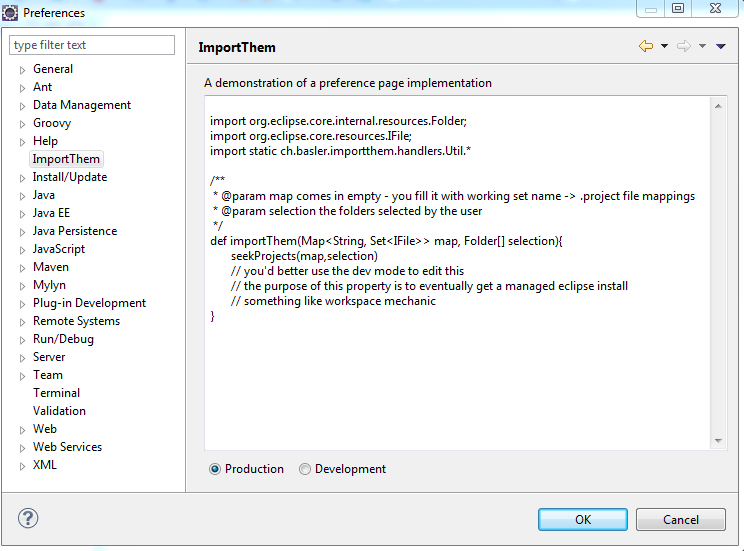

Import Them
==========

A given directory structure grouping some eclipse projects to their working sets and Importing them by hand is a
cumbersome job. Especially when this is a regular job. To automate this work you can use the Import Them 
standard feature or write your own in groovy.

### install 

via [update site](http://baloise.github.io/importthem/updatesite/) 

Extra Groovy commpilers/Groovy Commpiler 2.0 Feature 

Groovy-Eclipse/Groovy-Eclipse Feature

Uncategorized/JDT Core patch for Groovy-Eclipse plugin

### Manual

In the preference page of eclipse you can see the currently used groovy script with the standard behaviour.

Whens switching to Development you have Import Them project in your workspace and can edit the groovy script.

